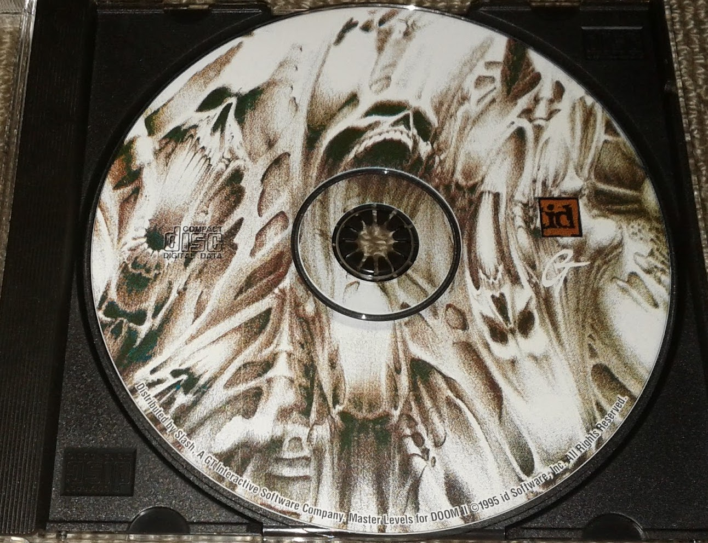

<h1 align="center"> MAXIMUM DOOM</h1>
<h3 align="center">Collection of community-made levels</h3>

---

$~~~~~~~~~~~$

## :clipboard: What is Maximum Doom: 
Maximum Doom is a collection of community-made levels included on the "Master Levels for Doom II"-CD, 
released by Id Software in 1995. The collection was Id Software's answer to the various Doom level 
collection CDs that had begun to circulate around the time. It contained 21 levels selected & licensed 
by Id Software (the Master Levels) and a larger collection of 1830 other levels (Maximum Doom). 

---

## :floppy_disk: Download
:godmode: **Download**: 
[MAXIMUM_DOOM_COLLECTION.rar](https://github.com/Official-KEX/Maximum-DOOM-Collection/raw/main/DOWNLOAD/MAXIMUM_DOOM_COLLECTION.rar) - 90.5MB  

:suspect: **Individual**: 
[DOOM_1_LEVELS_ONLY.rar](https://github.com/Official-KEX/Maximum-DOOM-Collection/raw/main/DOWNLOAD/DOOM_1_LEVELS_ONLY.rar) - 11.2MB  
[DOOM_2_LEVELS_ONLY.rar](https://github.com/Official-KEX/Maximum-DOOM-Collection/raw/main/DOWNLOAD/DOOM_2_LEVELS_ONLY.rar) - 82.4MB  

---

## :information_source: **Note:**
I am uploading this purely for archival and historical reasons.  
If you are one of the map authors and you want your map to be removed from this archive,  
simply contact me via E-Mail at `git@arcadia-systems.de`!  

---

## :hearts: **Greetings to:**
My Mom, everyone in the DOOM Community, John Romero, id Software, Bethesda and everyone else i forgor. 
You are all awesome <3 
**~** *[KEX]*

---

$~~~~~~~~~~~$
